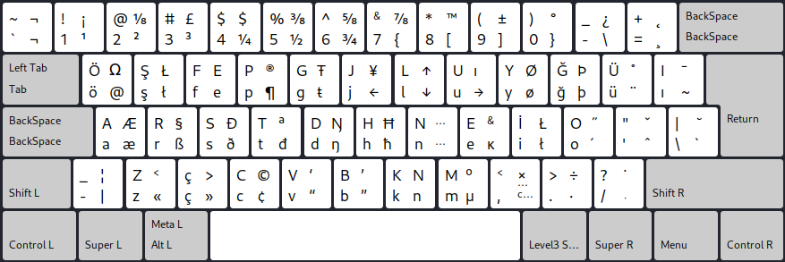

## Colemak for the Turkish alphabet



## Install on Linux

Run:

```fish
git clone --depth=1 https://github.com/salif/xkc-installer /tmp/xkc-installer
git clone --depth=1 https://github.com/salif/colemak-tr /tmp/colemak-tr
sudo EDITOR="${EDITOR:-nano}" /tmp/xkc-installer/installer.bash /tmp/colemak-tr/linux/xkc.conf
```

Then add `Turkish (Colemak)` via your desktop environment's settings.

If it doesn't work then create an issue on this repository
